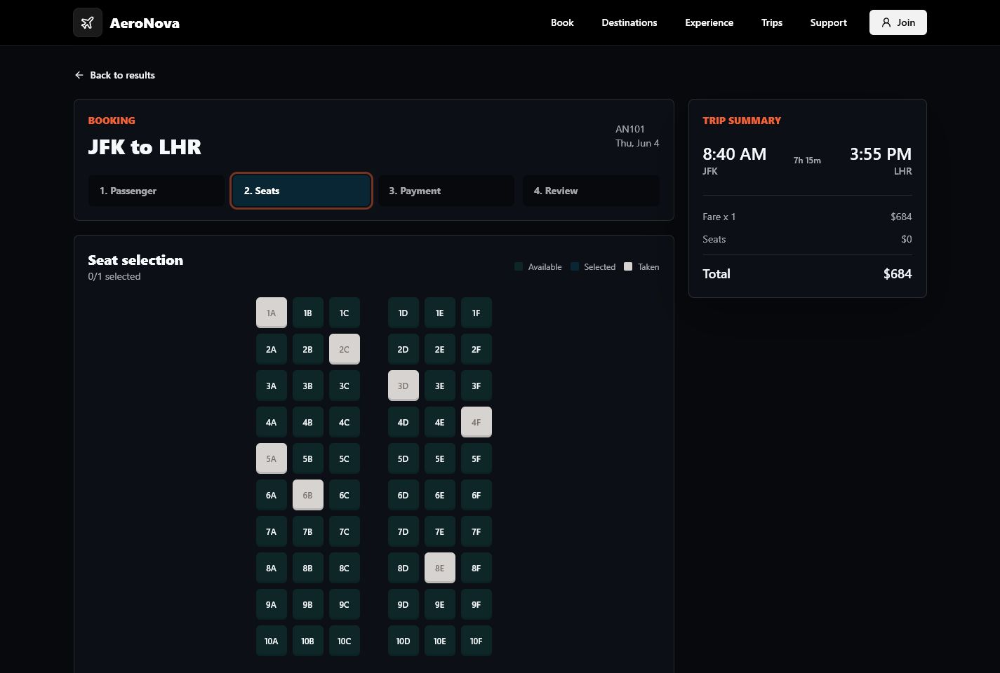
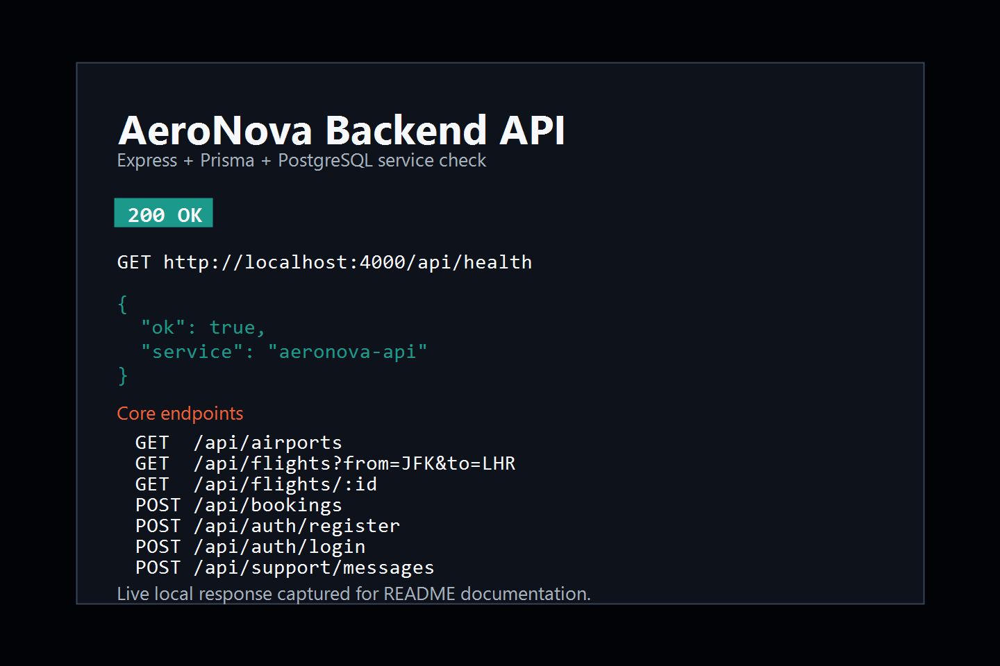

# AeroNova

AeroNova is a fictional premium airline booking MVP built with React, TypeScript, Tailwind CSS, Node.js, Express, PostgreSQL, and Prisma.

## Screenshots

### Premium Airline Homepage


### Booking And Seat Selection



### Backend API Health



## Product Scope

- Dark premium landing page with real aviation video and photo assets
- Flight search form with airport, date, passenger, and cabin controls
- Flight results page with sorting and filtering
- Passenger, seat, payment-preview, and review booking flow
- Seat map with available, selected, and taken seat states
- Login and register screens
- Manage trip lookup by confirmation code and email
- Functional support ticket form
- Account, privacy, accessibility, and 404 routes
- Express API backed by Prisma and PostgreSQL, with demo fallbacks
- Seed data for sample airports, flights, bookings, passengers, and seats

## Tech Stack

- React + Vite + TypeScript
- Tailwind CSS
- Node.js + Express
- PostgreSQL
- Prisma ORM
- Python/FastAPI analytics service planned for a later phase

## Folder Structure

```text
.
├── client/             React + Vite + Tailwind app
├── docs/screenshots/   README screenshots
├── scripts/            Local setup/media helper scripts
├── server/             Express API + Prisma
├── .env.example        Shared environment example
└── package.json        Workspace scripts
```

## Getting Started

1. Install dependencies.

```bash
npm install
```

2. Create environment files.

```bash
cp .env.example .env
cp .env.example server/.env
cp .env.example client/.env
```

3. Start PostgreSQL and create a database named `aeronova`.

On Windows with PostgreSQL installed in the default location, you can run the setup script:

```powershell
.\scripts\setup-local-postgres.ps1
```

The script prompts for PostgreSQL credentials, creates the `aeronova` database if needed, writes local `.env` files, pushes the Prisma schema, and seeds demo data.

4. Or manually generate Prisma client, push the schema, and seed demo data.

```bash
npm run db:generate
npm run db:push
npm run db:seed
```

5. Run the app.

```bash
npm run dev
```

The client runs on [http://localhost:5173](http://localhost:5173), and the API runs on [http://localhost:4000/api](http://localhost:4000/api).

## API Endpoints

- `GET /api/health`
- `GET /api/airports`
- `GET /api/flights?from=JFK&to=LHR&date=YYYY-MM-DD`
- `GET /api/flights/:id`
- `POST /api/bookings`
- `GET /api/bookings/:confirmationCode?email=user@example.com`
- `POST /api/auth/register`
- `POST /api/auth/login`
- `POST /api/support/messages`

If PostgreSQL is not configured yet, the API returns in-memory demo flights so the frontend can still be explored.

## Verification

```bash
npm run typecheck
npm run build
```

## Future Phase Notes

The repo is ready for a later `analytics/` service using Python and FastAPI. Suggested next endpoints include route demand forecasting, conversion funnel analytics, fare trend snapshots, and seat-map utilization.
